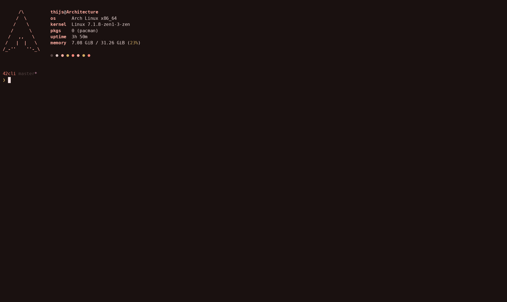

# 42cli

A Ratatui terminal client for the 42 intranet — built for 42 Belgium
students, wired straight into the same endpoints the web UIs use
(including `slots.42belgium.be` for slot booking).

```
cargo run --release
```

Sessions (tokens + cookies) are cached in `~/.config/42cli/session.json`
(`0600`) and restored on next start — the refresh token lasts ~30 days.



## Features

- **Dashboard** — level with percentage, grade, wallet, evaluation
  points, current location, pace (milestone, deadline, days
  remaining/elapsed), blackhole countdown, 30-day logtime chart with
  today/week/month totals, weekly attendance, achievements, upcoming
  events (with subscription state), evaluation duties and notifications.
- **Projects** — active / available / done segments over the holy graph,
  full detail (rules, description, difficulty, duration), team members,
  git repository, locked date, and **document downloads** (subjects,
  archives) to `~/Downloads/42cli-documents/`.
- **Slots** — open/close availability hours at both campuses with an
  inter-campus option, project slot booking through
  `slots.42belgium.be`, your reservations (★) with cancel, and a
  project sync button.
- **Search** — login-prefix user search; Enter opens a full profile
  view (cursus levels, logtime, achievements, tutoring).
- **Clusters** — occupied seats grouped by cluster with host, login and
  since-when.
- **Never blocks** — every request runs on a worker thread with a
  multi-threaded tokio runtime; the UI keeps rendering (spinners,
  partial data) while answers stream in.
- **Fast by default** — TTL disk cache (`~/.cache/42cli/`) for the
  graph, profiles, logtime, events and clusters; dashboards pre-cache
  in parallel right after login; heavy tabs lazy-load on first visit.

## Keys

| Key            | Action                                  |
| -------------- | --------------------------------------- |
| `1`..`6`, `Tab`| switch tabs                             |
| `r`            | refresh current tab (bypass cache)      |
| `n`            | notifications overlay                   |
| `?`            | help overlay                            |
| `L`            | logout                                  |
| `q` / `Ctrl+C` | quit                                    |

Per-tab bindings are listed in the status bar and the `?` overlay.

## Development

```sh
cargo build            # zero warnings, enforced
cargo clippy --all-targets
cargo fmt
cargo test
```

Live end-to-end tests (hit the real 42 APIs, no writes):

```sh
CLI42_TEST_USER=… CLI42_TEST_PASS=… cargo test -- --ignored --nocapture
```

## Layout

```
src/api/    HTTP layer: auth chains, intrapy, translate/edtrax/pace,
            intra web scraping, slots.42belgium.be
src/ui/     one module per screen + theme/widgets
src/bus.rs  command/msg bridge between the sync TUI loop and async workers
src/worker.rs  fan-out dispatch on the tokio runtime
```
